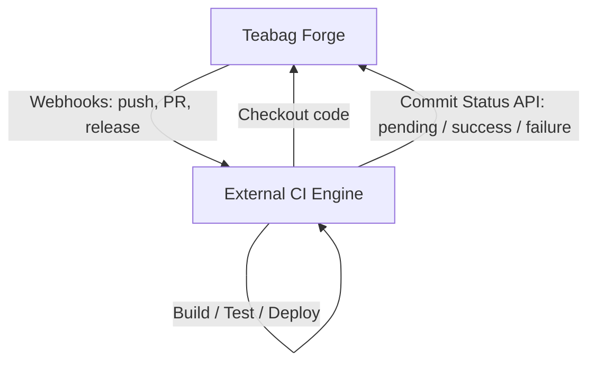

# Generic External CI Integration (CircleCI / Buildkite)
---
icon: lucide/git-merge
---

Teabag does not embed a CI engine. It exposes generic webhooks and commit-status APIs that any external CI system (CircleCI, Buildkite, etc.) can use.
# External CI Integration

## Webhook Events
Teabag does not need to become a CI platform. 

Generic webhook payloads are delivered by `services/webhook/` for events including:
Instead of embedding heavy container orchestration engines or long-running runner daemons directly inside the forge web process, Teabag adheres to a decoupled integration architecture:

- `push`
- `pull_request`
- `pull_request_sync`
- `status`
- `release`
- `repository`


Event payloads include `repository`, `ref` (branch/tag), `commit` SHA, and PR information where applicable.
```
Teabag
  ↓ (webhooks / commit statuses)
External CI
  ↓
Build / Test / Deploy
```

## Commit Status / Check API
This model ensures your Git forge remains responsive, lightweight, and stable—even if a test suite runs out of memory or a container build pegs all available CPU cores.

External CI systems can report build results back to Teabag via the REST endpoint:
---

## Compatible CI Systems & Workflows

Any CI/CD system capable of consuming HTTP webhooks and posting to a REST API can integrate with Teabag. Common examples include:

- **[Woodpecker CI](https://woodpecker-ci.org/)**: A lightweight, community-oriented pipeline engine designed for self-hosting with container-based workflows.
- **[Drone CI](https://drone.io/)**: Declarative pipeline automation configured via `.drone.yml`.
- **[CircleCI](https://circleci.com/) / [Buildkite](https://buildkite.com/)**: Cloud or hybrid hosted pipeline runners triggered via repository webhooks.
- **Gitea Runner / Forgejo Runner**: Where technically applicable, runners communicating via standard actions/v1 polling or webhook endpoints can report task and check outcomes.

---

## How the Integration Works

The workflow relies on two standard, provider-agnostic mechanisms:

### 1. Webhook Delivery

When git events occur, Teabag dispatches standard JSON payloads via `services/webhook/`. Supported trigger events include:

- `push`: Triggered on branch and tag pushes.
- `pull_request`: Triggered when PRs are opened, closed, reassigned, or labeled.
- `pull_request_sync`: Triggered when the head branch of an open PR receives new commits.
- `status`: Triggered when a commit status is updated.
- `release`: Triggered on new tagged release publication.
- `repository`: Triggered on repository state changes (creation, fork, deletion).

Payloads contain standard metadata: the repository clone URLs, commit SHA, branch reference (`ref`), and sender details.

### 2. Commit Status API

External CI runners report progress and final results back to Teabag using standard REST endpoints:

```http
POST /api/v1/repos/{owner}/{repo}/statuses/{sha}
GET  /api/v1/repos/{owner}/{repo}/statuses/{sha}
GET  /api/v1/repos/{owner}/{repo}/commits/{sha}/statuses
GET  /api/v1/repos/{owner}/{repo}/commits/{sha}/status
```
POST /repos/{owner}/{repo}/statuses/{sha}
GET /repos/{owner}/{repo}/statuses/{sha}
GET /repos/{owner}/{repo}/commits/{sha}/statuses
GET /repos/{owner}/{repo}/commits/{sha}/status

#### Status States

| State | Description | UI Representation |
|:------|:------------|:------------------|
| `pending` | Build or test execution has started | Yellow pending indicator |
| `success` | Build passed successfully | Green checkmark |
| `failure` | Test failure or build error | Red cross |
| `error`   | System pipeline error or timeout | Red exclamation mark |
| `warning` | Non-fatal linting or advisory issue | Yellow warning sign |
| `skipped` | Pipeline step was skipped | Neutral indicator |

#### Status Payload Example

```json
{
  "state": "success",
  "target_url": "https://ci.example.com/build/42",
  "description": "All 182 unit and integration tests passed",
  "context": "continuous-integration/woodpecker"
}
```

Status states: `pending`, `success`, `failure`, `error`, `warning`, `skipped`.
---

This allows CircleCI / Buildkite pipelines to push check results that appear in PR and commit pages.
## Step-by-Step Setup

## Configuration Path
1. **Generate an Access Token**: In your Teabag user settings, generate a Personal Access Token with the `repo:status` scope for your CI service.
2. **Configure Webhook in Teabag**:
   - Navigate to **Repository Settings** &rarr; **Webhooks** &rarr; **Add Webhook**.
   - Enter your external CI's listener URL.
   - Choose the events you want to trigger builds for (typically `push` and `pull_request`).
3. **Execute and Report**:
   - Your CI system receives the webhook, clones the repo using the provided commit SHA, and runs your test matrix.
   - Using the access token, the runner calls `POST /api/v1/repos/{owner}/{repo}/statuses/{sha}` with the build status and logs link.
4. **View in Teabag**: The status appears immediately on commit lists and in the Pull Request review header.

1. In Teabag: Create a repository webhook pointing to the external CI endpoint (e.g., CircleCI webhook URL or Buildkite webhook URL).
2. Select events: `push`, `pull_request`, `status`.
3. The CI system receives JSON payloads with clone URLs, commit SHAs, and branch info.
4. After build/test, the CI system POSTs status back to Teabag using the commit-status API with an OAuth2/app token that has `repo:status` scope.

No provider-specific backend code is required; the generic webhook and commit-status APIs are sufficient.
No custom enterprise runner daemons or provider-specific binary modifications are required.
