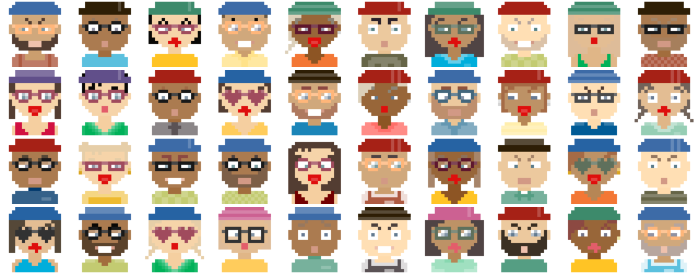

# Golang port of DiceBear Avatars

which in turn were inspired by 8biticon avatars



## Usage

import `codeberg.org/Codeberg/avatars` & use `string svg = avatars.MakeAvatar(seed)`

## Build & Use Example

```shell
# will build the binary
go build -o avatars example/main.go
# Create a random avatar and write it to /tmp/avatar.svg. Note that for the same seed string always the same image will be generated.
./avatars my-special-seed-string > /tmp/avatar.svg
# Open SVG file with image viewer
eog /tmp/avatar.svg
```

## Create mosaic with example images using rsvg and imagemagick montage

```shell
go build -o avatars example/main.go
for i in {1..40} ; do
	./avatars my-special-seed-string_$i > /tmp/avatar_$i.svg
	rsvg-convert /tmp/avatar_$i.svg -z 10 -o /tmp/avatar_$i.png
done
montage -tile 10x4 /tmp/avatar_*.png /tmp/mosaic.png
eog /tmp/mosaic.png
```
