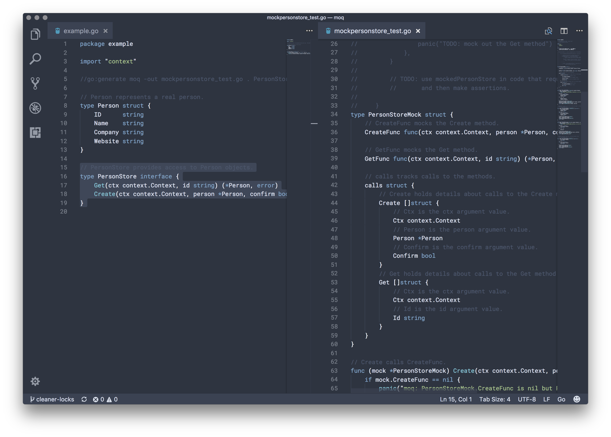

 [](https://travis-ci.org/matryer/moq) [](https://goreportcard.com/report/github.com/matryer/moq)

Interface mocking tool for go generate.

By [Mat Ryer](https://twitter.com/matryer) and [David Hernandez](https://github.com/dahernan), with ideas lovingly stolen from [Ernesto Jimenez](https://github.com/ernesto-jimenez).

### What is Moq?

Moq is a tool that generates a struct from any interface. The struct can be used in test code as a mock of the interface.



above: Moq generates the code on the right.

You can read more in the [Meet Moq blog post](http://bit.ly/meetmoq).

### Installing

To start using Moq, just run go get:
```
$ go get github.com/matryer/moq
```

### Usage

```
moq [flags] destination interface [interface2 [interface3 [...]]]
  -out string
    	output file (default stdout)
  -pkg string
    	package name (default will infer)
Specifying an alias for the mock is also supported with the format 'interface:alias'
Ex: moq -pkg different . MyInterface:MyMock
```

In a command line:

```
$ moq -out mocks_test.go . MyInterface
```

In code (for go generate):

```go
package my

//go:generate moq -out myinterface_moq_test.go . MyInterface

type MyInterface interface {
	Method1() error
	Method2(i int)
}
```

Then run `go generate` for your package.

### How to use it

Mocking interfaces is a nice way to write unit tests where you can easily control the behaviour of the mocked object.

Moq creates a struct that has a function field for each method, which you can declare in your test code.

In this example, Moq generated the `EmailSenderMock` type:

```go
func TestCompleteSignup(t *testing.T) {

	var sentTo string

	mockedEmailSender = &EmailSenderMock{
		SendFunc: func(to, subject, body string) error {
			sentTo = to
			return nil
		},
	}

	CompleteSignUp("me@email.com", mockedEmailSender)

	callsToSend := len(mockedEmailSender.SendCalls())
	if callsToSend != 1 {
		t.Errorf("Send was called %d times", callsToSend)
	}
	if sentTo != "me@email.com" {
		t.Errorf("unexpected recipient: %s", sentTo)
	}

}

func CompleteSignUp(to string, sender EmailSender) {
	// TODO: this
}
```

The mocked structure implements the interface, where each method calls the associated function field.

## Tips

* Keep mocked logic inside the test that is using it
* Only mock the fields you need
* It will panic if a nil function gets called
* Name arguments in the interface for a better experience
* Use closured variables inside your test function to capture details about the calls to the methods
* Use `.MethodCalls()` to track the calls
* Use `go:generate` to invoke the `moq` command

## License

The Moq project (and all code) is licensed under the [MIT License](LICENSE).

The Moq logo was created by [Chris Ryer](http://chrisryer.co.uk) and is licensed under the [Creative Commons Attribution 3.0 License](https://creativecommons.org/licenses/by/3.0/).
